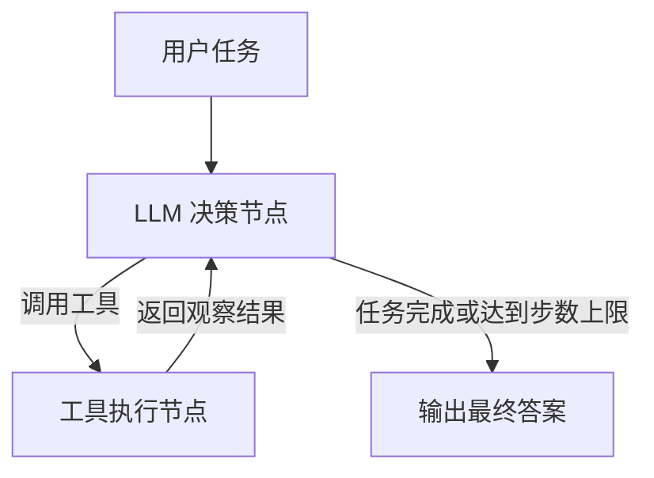

## 自动化浏览器任务

一个基于 **LangGraph** 和 **大语言模型** 的智能浏览器自动化代理，能够理解自然语言指令，自主操作浏览器完成复杂任务，如信息提取、表单填写、网页交互等。系统采用 **ReAct** 推理循环，结合 Playwright 实现浏览器控制，并支持多页签、持久化状态、错误恢复等高级特性。

---
##  系统架构



##  快速开始

### 安装依赖
Python 3.9+
```bash
python -m venv venv
source venv/bin/activate   # Windows: venv\Scripts\activate
pip install -r requirements.txt
```

### 安装 Playwright 浏览器
```bash
playwright install chromium
```
若 Linux 系统缺少依赖，执行：
```bash
playwright install-deps chromium
```

### 配置 API Key
在项目根目录创建 .env 文件：
```bash
DEEPSEEK_API_KEY=sk-your-deepseek-api-key
HEADLESS=false        # 可选，设为 true 使用无头模式
ALLOWED_DOMAINS=      # 可选，逗号分隔的域名白名单（如 google.com, baidu.com）
```

### 运行
```bash
python main.py
```
输入任务描述，例如：“打开百度，搜索“人工智能”，提取前三条搜索结果的标题。”Agent 将自动执行浏览器操作并输出结果。

##  项目结构

| 文件 | 说明 |
|------|------|
| .env                  | 环境变量 |
| requirements.txt      | 依赖列表 |
| state.py              | Agent 状态定义 |
| tools.py              | 浏览器工具集（Playwright 封装） |
| agents.py             | LangGraph 工作流与 ReAct 循环 |
| main.py               | 命令行入口 |


##  技术栈

* LangGraph
* LangChain
* DeepSeek
* Playwright
* FastAPI
* Pydantic
* python-dotenv


## License

> Copyright (c) 2026 Pink7rousers

This project is licensed under the [MIT License](https://opensource.org/licenses/mit-license.php) - see the [LICENSE](https://github.com/Pink7rousers/multi-agent-article-generator/blob/master/LICENSE) file for details.
